# Frontend Architecture - Modular Design

This diagram illustrates the frontend architecture of the Kelmah platform, showcasing the modular domain-driven design approach with detailed module organization and data flow.

## Frontend Architecture Overview

The frontend follows a **modular domain-driven design** pattern where:

- **Modules are organized by domain** (auth, jobs, messaging, etc.)
- **Each module is self-contained** with its own components, services, and contexts
- **Shared functionality** is centralized in the common module
- **State management** uses both Redux and Context API appropriately
- **API communication** is standardized with service-specific clients

## Key Architectural Patterns

1. **Modular Architecture**: Domain-specific modules for maintainability
2. **Component-Based Design**: Reusable UI components following atomic design
3. **Hooks Pattern**: Custom hooks for shared logic and API calls
4. **Context API**: For component tree state management
5. **Container/Presentation Pattern**: Separating logic from presentation
6. **Service Layer Pattern**: Abstracted API communication

```mermaid
graph TB
    subgraph "FRONTEND ARCHITECTURE - MODULAR DESIGN"
        subgraph "Application Entry"
            MAIN[main.jsx<br/>- ReactDOM Root<br/>- Provider Setup<br/>- Error Boundary]
            APP[App.jsx<br/>- Route Configuration<br/>- Theme Provider<br/>- Layout Wrapper]
        end
        
        subgraph "State Management Layer"
            REDUX[Redux Store<br/>- Auth Slice<br/>- Dashboard Slice<br/>- Hirer Slice<br/>- Global State]
            
            subgraph "Context Providers"
                AUTH_CTX[AuthContext<br/>- User State<br/>- Token Management<br/>- Authentication]
                NOTIF_CTX[NotificationContext<br/>- Alert System<br/>- Toast Messages]
                MSG_CTX[MessageContext<br/>- Chat State<br/>- Real-time Updates]
                PAY_CTX[PaymentContext<br/>- Payment State<br/>- Transaction Data]
                CONTRACT_CTX[ContractContext<br/>- Contract Management<br/>- Milestone Tracking]
            end
        end
        
        subgraph "Module Architecture"
            subgraph "Auth Module"
                AUTH_PAGES[Pages<br/>- LoginPage<br/>- RegisterPage]
                AUTH_COMP[Components<br/>- Login Form<br/>- Register Form<br/>- Protected Route]
                AUTH_SVC[Services<br/>- authService.js<br/>- API Calls<br/>- Token Logic]
            end
            
            subgraph "Job Module"
                JOB_PAGES[Pages<br/>- JobDetailsPage<br/>- JobSearchPage]
                JOB_COMP[Components<br/>- Job Cards<br/>- Search Filters<br/>- Application Forms]
                JOB_SVC[Services<br/>- Job API<br/>- Search Logic]
            end
            
            subgraph "Dashboard Module"
                DASH_PAGES[Pages<br/>- DashboardPage<br/>- WorkerDashboard<br/>- HirerDashboard]
                DASH_COMP[Components<br/>- StatisticsCard<br/>- ActivityFeed<br/>- QuickActions]
                DASH_SVC[Services<br/>- Dashboard API<br/>- Analytics]
            end
            
            subgraph "Messaging Module"
                MSG_PAGES[Pages<br/>- MessagingPage<br/>- ConversationView]
                MSG_COMP[Components<br/>- Chat Interface<br/>- Message Bubbles<br/>- File Upload]
                MSG_SVC[Services<br/>- messageService.js<br/>- WebSocket Client<br/>- Real-time Logic]
            end
            
            subgraph "Common Module"
                COMMON_COMP[Components<br/>- LoadingScreen<br/>- ErrorBoundary<br/>- UI Components]
                COMMON_UTILS[Utils<br/>- API Utils<br/>- Format Utils<br/>- Validators]
                COMMON_HOOKS[Hooks<br/>- useApi<br/>- useWebSocket<br/>- useDebounce]
            end
        end
        
        subgraph "API Communication Layer"
            AXIOS_CONFIG[Axios Configuration<br/>- Base Instance<br/>- Interceptors<br/>- Error Handling]
            
            subgraph "Service Clients"
                AUTH_CLIENT[Auth Service Client<br/>- Login/Register<br/>- Token Refresh<br/>- Profile]
                USER_CLIENT[User Service Client<br/>- Profile Management<br/>- Settings<br/>- Search]
                JOB_CLIENT[Job Service Client<br/>- CRUD Operations<br/>- Applications<br/>- Contracts]
                MSG_CLIENT[Messaging Client<br/>- Send Messages<br/>- File Upload<br/>- History]
                PAY_CLIENT[Payment Client<br/>- Transactions<br/>- Wallet<br/>- Stripe]
            end
        end
        
        subgraph "Routing & Navigation"
            ROUTES[Route Configuration<br/>- Public Routes<br/>- Protected Routes<br/>- Role-based Access]
            LAYOUT[Layout Components<br/>- Header<br/>- Sidebar<br/>- Navigation<br/>- Footer]
        end
    end
    
    %% Flow Connections
    MAIN --> APP
    APP --> REDUX
    APP --> AUTH_CTX
    APP --> NOTIF_CTX
    APP --> MSG_CTX
    APP --> PAY_CTX
    APP --> CONTRACT_CTX
    
    %% Module Dependencies
    AUTH_PAGES --> AUTH_COMP
    AUTH_COMP --> AUTH_SVC
    AUTH_SVC --> AUTH_CLIENT
    
    JOB_PAGES --> JOB_COMP
    JOB_COMP --> JOB_SVC
    JOB_SVC --> JOB_CLIENT
    
    DASH_PAGES --> DASH_COMP
    DASH_COMP --> DASH_SVC
    
    MSG_PAGES --> MSG_COMP
    MSG_COMP --> MSG_SVC
    MSG_SVC --> MSG_CLIENT
    
    %% Common Dependencies
    AUTH_COMP --> COMMON_COMP
    JOB_COMP --> COMMON_COMP
    DASH_COMP --> COMMON_COMP
    MSG_COMP --> COMMON_COMP
    
    AUTH_SVC --> COMMON_UTILS
    JOB_SVC --> COMMON_UTILS
    MSG_SVC --> COMMON_UTILS
    
    %% API Layer
    AUTH_CLIENT --> AXIOS_CONFIG
    USER_CLIENT --> AXIOS_CONFIG
    JOB_CLIENT --> AXIOS_CONFIG
    MSG_CLIENT --> AXIOS_CONFIG
    PAY_CLIENT --> AXIOS_CONFIG
    
    %% Layout and Routing
    APP --> ROUTES
    APP --> LAYOUT
    
    classDef entry fill:#ffebee
    classDef state fill:#e8f5e8
    classDef module fill:#e3f2fd
    classDef api fill:#fff8e1
    classDef routing fill:#f3e5f5
    
    class MAIN,APP entry
    class REDUX,AUTH_CTX,NOTIF_CTX,MSG_CTX,PAY_CTX,CONTRACT_CTX state
    class AUTH_PAGES,AUTH_COMP,AUTH_SVC,JOB_PAGES,JOB_COMP,JOB_SVC,DASH_PAGES,DASH_COMP,DASH_SVC,MSG_PAGES,MSG_COMP,MSG_SVC,COMMON_COMP,COMMON_UTILS,COMMON_HOOKS module
    class AXIOS_CONFIG,AUTH_CLIENT,USER_CLIENT,JOB_CLIENT,MSG_CLIENT,PAY_CLIENT api
    class ROUTES,LAYOUT routing
```



## Module Structure

Each module follows a consistent internal structure:

```
src/modules/{domain}/
├── components/          # React components specific to the module
│   ├── common/         # Shared components within the module
│   └── {feature}/      # Feature-specific components
├── contexts/           # React contexts for state management
├── hooks/              # Custom hooks for the module
├── pages/              # Page components (route endpoints)
├── services/           # API services and business logic
└── utils/              # Module-specific utility functions
```

## State Management Strategy

### Redux Store
- **Global application state** (auth, dashboard, user preferences)
- **Cross-module state** that needs to persist across navigation
- **Complex state logic** with multiple actions and reducers

### Context API
- **Component tree state** (theme, notifications, real-time data)
- **Module-specific state** that doesn't need global persistence
- **Real-time updates** (messaging, notifications)

### Local State
- **Component-specific state** (form inputs, UI toggles)
- **Temporary state** (loading states, modal visibility)

## API Communication

### Service-Specific Clients
Each backend service has its own axios client configured with:
- **Base URL**: Service-specific endpoints
- **Authentication**: Automatic token injection
- **Error Handling**: Standardized error responses
- **Request/Response Interceptors**: Logging and transformation

### Environment Configuration
- **Development**: Proxy configuration for local development
- **Production**: Direct service URLs on Render.com
- **Service Discovery**: Centralized configuration management

## Component Architecture

### Atomic Design Principles
1. **Atoms**: Basic UI elements (buttons, inputs, icons)
2. **Molecules**: Simple component combinations (search box, card header)
3. **Organisms**: Complex component sections (navigation, job list)
4. **Templates**: Page layouts and structure
5. **Pages**: Complete views with data integration

### Reusability Strategy
- **Common components** for shared UI elements
- **Higher-order components** for cross-cutting concerns
- **Custom hooks** for shared logic and API calls
- **Utility functions** for data transformation and validation