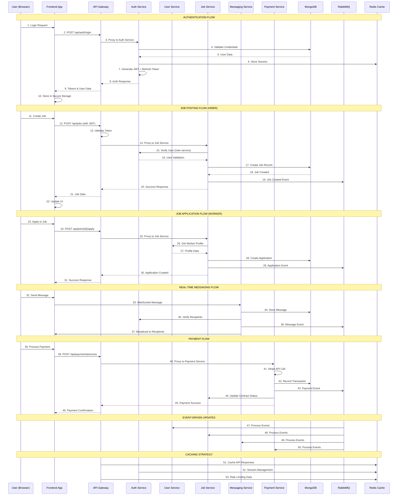

# Data Flow Sequence Diagram

This sequence diagram illustrates the complete data flow through the Kelmah platform, showing how different user actions trigger interactions between frontend, API gateway, microservices, and infrastructure components.

## Key Flows Illustrated

1. **Authentication Flow**: User login with JWT token management
2. **Job Posting Flow**: Hirer creating a new job posting
3. **Job Application Flow**: Worker applying to a job
4. **Real-time Messaging Flow**: WebSocket-based chat communication
5. **Payment Processing Flow**: Stripe payment integration
6. **Event-Driven Updates**: Asynchronous event processing

## Sequence Diagram

## Flow Details

### 1. Authentication Flow (Steps 1-10)
- User submits login credentials
- Frontend sends request through API Gateway
- Auth Service validates against MongoDB
- Session stored in Redis for fast lookup
- JWT and refresh tokens generated and returned
- Frontend stores tokens securely

### 2. Job Posting Flow (Steps 11-22)
- Authenticated hirer creates a new job
- Request includes JWT token for authentication
- API Gateway validates token before proxying
- Job Service verifies user with Auth Service
- Job record created in MongoDB
- Event published to RabbitMQ for other services
- UI updated with new job data

### 3. Job Application Flow (Steps 23-31)
- Worker applies to an existing job
- Job Service retrieves worker profile from User Service
- Application record created in database
- Event notifications sent through message queue
- Success response returned to frontend

### 4. Real-time Messaging Flow (Steps 32-37)
- Direct WebSocket connection bypasses API Gateway
- Message stored in MongoDB for persistence
- Recipients verified through Auth Service
- Message broadcast to all active connections
- Event published for offline notifications

### 5. Payment Processing Flow (Steps 38-46)
- Payment request goes through standard API flow
- Payment Service integrates with Stripe API
- Transaction recorded for audit and reconciliation
- Contract status updated through Job Service
- Payment confirmation returned to user

### 6. Event-Driven Updates (Steps 47-50)
- Services subscribe to relevant events from RabbitMQ
- Asynchronous processing of business logic
- Data consistency maintained across services
- Loose coupling between service components

### 7. Caching Strategy (Steps 51-53)
- API responses cached in Redis for performance
- Session data stored for fast authentication
- Rate limiting counters maintained per user/IP

## Key Architectural Benefits

### Scalability
- **Horizontal scaling**: Each service can scale independently
- **Load distribution**: API Gateway distributes load across service instances
- **Caching**: Redis reduces database load and improves response times

### Reliability
- **Circuit breakers**: Services fail gracefully when dependencies are down
- **Event sourcing**: RabbitMQ ensures eventual consistency
- **Redundancy**: Multiple service instances handle failover

### Security
- **Token validation**: Centralized authentication at API Gateway
- **Inter-service auth**: Services verify requests from other services
- **Secure storage**: Sensitive data encrypted at rest and in transit

### Performance
- **Async processing**: Events handled asynchronously for better UX
- **WebSocket**: Real-time features bypass HTTP overhead
- **Caching layers**: Multi-level caching strategy for optimal performance

## Error Handling

### Frontend Error Handling
- Axios interceptors catch and handle HTTP errors
- User-friendly error messages displayed
- Automatic token refresh on 401 errors
- Retry logic for network failures

### Service Error Handling
- Standardized error response format across services
- Proper HTTP status codes for different error types
- Error logging and monitoring for debugging
- Graceful degradation when services are unavailable

### Event Processing Errors
- Dead letter queues for failed message processing
- Retry mechanisms with exponential backoff
- Error notifications for critical failures
- Manual intervention capabilities for stuck processes