# Microservices Architecture

This diagram details the internal structure of each microservice in the Kelmah platform, showing how services are organized, their responsibilities, and how they communicate with each other and the database layer.

## Microservices Overview

The Kelmah backend consists of 6 main microservices plus an API Gateway:

1. **API Gateway (Port 5000)**: Central entry point and request router
2. **Auth Service (Port 3001)**: Authentication and authorization
3. **User Service (Port 3002)**: User profiles and management
4. **Job Service (Port 3004)**: Job listings, applications, and contracts
5. **Messaging Service (Port 3003)**: Real-time chat and communication
6. **Payment Service (Port 3005)**: Payment processing and escrow
7. **Review Service (Port 3006)**: Reviews and rating system

## Service Architecture

```mermaid
graph TB
    subgraph "MICROSERVICES ARCHITECTURE"
        subgraph "API Gateway - Port 5000"
            GW_SERVER[server.js<br/>- Express Server<br/>- Middleware Chain<br/>- Service Registry]
            GW_AUTH[Auth Middleware<br/>- JWT Validation<br/>- Token Verification<br/>- User Context]
            GW_PROXY[Proxy Layer<br/>- Request Routing<br/>- Load Balancing<br/>- Error Handling]
            GW_ROUTES[Route Management<br/>- Service Discovery<br/>- Path Rewriting<br/>- Rate Limiting]
        end
        
        subgraph "Auth Service - Port 3001"
            AS_CONTROLLER[Auth Controller<br/>- Login/Register<br/>- Token Management<br/>- Password Reset]
            AS_MODELS[Models<br/>- User Model<br/>- RefreshToken<br/>- Device Tracking]
            AS_UTILS[Utils<br/>- JWT Helper<br/>- Password Hash<br/>- Validation]
            AS_MW[Middleware<br/>- Rate Limiting<br/>- Request Validation<br/>- Security Headers]
        end
        
        subgraph "User Service - Port 3002"
            US_CONTROLLER[User Controller<br/>- Profile Management<br/>- Settings<br/>- Search & Discovery]
            US_MODELS[Models<br/>- User Profile<br/>- Portfolio<br/>- Skills<br/>- Experience]
            US_SERVICES[Services<br/>- Profile Service<br/>- Search Service<br/>- Notification Service]
        end
        
        subgraph "Job Service - Port 3004"
            JS_CONTROLLER[Job Controller<br/>- CRUD Operations<br/>- Applications<br/>- Contracts]
            JS_MODELS[Models<br/>- Job<br/>- Application<br/>- Contract<br/>- Milestone]
            JS_VALIDATION[Validation<br/>- Job Schema<br/>- Application Rules<br/>- Business Logic]
            JS_SERVICES[Services<br/>- Job Service<br/>- Application Service<br/>- Contract Service]
        end
        
        subgraph "Messaging Service - Port 3003"
            MS_CONTROLLER[Message Controller<br/>- Send/Receive<br/>- File Upload<br/>- History]
            MS_MODELS[Models<br/>- Conversation<br/>- Message<br/>- Attachment<br/>- User Status]
            MS_SOCKET[Socket Handler<br/>- WebSocket Manager<br/>- Real-time Events<br/>- Connection Pool]
            MS_SERVICES[Services<br/>- Message Service<br/>- File Service<br/>- Notification Service]
        end
        
        subgraph "Payment Service - Port 3005"
            PS_CONTROLLER[Payment Controller<br/>- Process Payments<br/>- Stripe Integration<br/>- Webhooks]
            PS_MODELS[Models<br/>- Transaction<br/>- Wallet<br/>- Escrow<br/>- Dispute]
            PS_INTEGRATIONS[Integrations<br/>- Stripe API<br/>- PayPal API<br/>- Bank APIs]
            PS_SERVICES[Services<br/>- Payment Service<br/>- Escrow Service<br/>- Dispute Service]
        end
        
        subgraph "Review Service - Port 3006"
            RS_MODELS[Models<br/>- Review<br/>- Rating<br/>- Analytics]
            RS_SERVICES[Services<br/>- Review Service<br/>- Rating Calculator<br/>- Analytics Service]
        end
        
        subgraph "Database Layer"
            subgraph "MongoDB Databases"
                AUTH_DB[(kelmah_auth<br/>- Users<br/>- Tokens<br/>- Sessions)]
                USER_DB[(kelmah_user<br/>- Profiles<br/>- Portfolio<br/>- Settings)]
                JOB_DB[(kelmah_job<br/>- Jobs<br/>- Applications<br/>- Contracts)]
                MSG_DB[(kelmah_messaging<br/>- Conversations<br/>- Messages<br/>- Files)]
                PAY_DB[(kelmah_payment<br/>- Transactions<br/>- Wallets<br/>- Escrow)]
                REV_DB[(kelmah_review<br/>- Reviews<br/>- Ratings<br/>- Analytics)]
            end
            
            POSTGRES[(PostgreSQL<br/>Legacy Data<br/>Migration Support)]
        end
        
        subgraph "Message Queue"
            RABBITMQ[RabbitMQ<br/>- Event Bus<br/>- Inter-service Communication<br/>- Async Processing]
            
            subgraph "Event Types"
                USER_EVENTS[User Events<br/>- Registration<br/>- Profile Updates<br/>- Status Changes]
                JOB_EVENTS[Job Events<br/>- Job Created<br/>- Application Received<br/>- Contract Signed]
                MSG_EVENTS[Message Events<br/>- New Message<br/>- File Shared<br/>- Status Update]
                PAY_EVENTS[Payment Events<br/>- Payment Processed<br/>- Escrow Released<br/>- Dispute Raised]
            end
        end
        
        subgraph "Caching Layer"
            REDIS[Redis<br/>- Session Storage<br/>- API Caching<br/>- Rate Limiting<br/>- Real-time Data]
        end
    end
    
    %% Gateway Connections
    GW_SERVER --> GW_AUTH
    GW_SERVER --> GW_PROXY
    GW_SERVER --> GW_ROUTES
    
    %% Gateway to Services
    GW_PROXY --> AS_CONTROLLER
    GW_PROXY --> US_CONTROLLER
    GW_PROXY --> JS_CONTROLLER
    GW_PROXY --> MS_CONTROLLER
    GW_PROXY --> PS_CONTROLLER
    GW_PROXY --> RS_SERVICES
    
    %% Auth Service Internal
    AS_CONTROLLER --> AS_MODELS
    AS_CONTROLLER --> AS_UTILS
    AS_CONTROLLER --> AS_MW
    AS_MODELS --> AUTH_DB
    
    %% User Service Internal
    US_CONTROLLER --> US_MODELS
    US_CONTROLLER --> US_SERVICES
    US_MODELS --> USER_DB
    
    %% Job Service Internal
    JS_CONTROLLER --> JS_MODELS
    JS_CONTROLLER --> JS_VALIDATION
    JS_CONTROLLER --> JS_SERVICES
    JS_MODELS --> JOB_DB
    
    %% Messaging Service Internal
    MS_CONTROLLER --> MS_MODELS
    MS_CONTROLLER --> MS_SOCKET
    MS_CONTROLLER --> MS_SERVICES
    MS_MODELS --> MSG_DB
    
    %% Payment Service Internal
    PS_CONTROLLER --> PS_MODELS
    PS_CONTROLLER --> PS_INTEGRATIONS
    PS_CONTROLLER --> PS_SERVICES
    PS_MODELS --> PAY_DB
    
    %% Review Service Internal
    RS_SERVICES --> RS_MODELS
    RS_MODELS --> REV_DB
    
    %% Legacy Database
    AS_MODELS --> POSTGRES
    US_MODELS --> POSTGRES
    
    %% Message Queue Connections
    AS_CONTROLLER --> RABBITMQ
    US_CONTROLLER --> RABBITMQ
    JS_CONTROLLER --> RABBITMQ
    MS_CONTROLLER --> RABBITMQ
    PS_CONTROLLER --> RABBITMQ
    RS_SERVICES --> RABBITMQ
    
    RABBITMQ --> USER_EVENTS
    RABBITMQ --> JOB_EVENTS
    RABBITMQ --> MSG_EVENTS
    RABBITMQ --> PAY_EVENTS
    
    %% Caching Connections
    GW_AUTH --> REDIS
    AS_CONTROLLER --> REDIS
    GW_ROUTES --> REDIS
    
    %% Inter-service Communication
    JS_CONTROLLER -.->|HTTP| US_CONTROLLER
    PS_CONTROLLER -.->|HTTP| JS_CONTROLLER
    MS_CONTROLLER -.->|HTTP| US_CONTROLLER
    
    classDef gateway fill:#f8bbd9
    classDef service fill:#b3d9ff
    classDef database fill:#c8e6c9
    classDef queue fill:#fff9c4
    classDef cache fill:#ffcccb
    
    class GW_SERVER,GW_AUTH,GW_PROXY,GW_ROUTES gateway
    class AS_CONTROLLER,AS_MODELS,AS_UTILS,AS_MW,US_CONTROLLER,US_MODELS,US_SERVICES,JS_CONTROLLER,JS_MODELS,JS_VALIDATION,JS_SERVICES,MS_CONTROLLER,MS_MODELS,MS_SOCKET,MS_SERVICES,PS_CONTROLLER,PS_MODELS,PS_INTEGRATIONS,PS_SERVICES,RS_MODELS,RS_SERVICES service
    class AUTH_DB,USER_DB,JOB_DB,MSG_DB,PAY_DB,REV_DB,POSTGRES database
    class RABBITMQ,USER_EVENTS,JOB_EVENTS,MSG_EVENTS,PAY_EVENTS queue
    class REDIS cache
```

## Service Responsibilities

### API Gateway
- **Request Routing**: Routes incoming requests to appropriate microservices
- **Authentication**: Validates JWT tokens and user sessions
- **Rate Limiting**: Prevents API abuse and ensures fair usage
- **CORS Handling**: Manages cross-origin requests
- **Load Balancing**: Distributes traffic across service instances

### Auth Service
- **User Authentication**: Login, registration, password management
- **JWT Management**: Token generation, validation, and refresh
- **OAuth Integration**: Social login with Google and LinkedIn
- **Session Management**: User session tracking and security
- **Device Tracking**: Multi-device login support

### User Service
- **Profile Management**: User profiles, portfolios, and skills
- **Search & Discovery**: Worker and hirer search functionality
- **Settings Management**: User preferences and configurations
- **Notification Preferences**: User communication settings
- **Data Analytics**: User behavior and engagement metrics

### Job Service
- **Job Management**: CRUD operations for job postings
- **Application Processing**: Worker job applications
- **Contract Management**: Contract creation and milestone tracking
- **Business Logic**: Job matching and recommendation algorithms
- **Validation**: Data validation and business rules enforcement

### Messaging Service
- **Real-time Chat**: WebSocket-based messaging
- **File Sharing**: Upload and sharing of documents/images
- **Conversation Management**: Chat history and participants
- **Notification Integration**: Message alerts and push notifications
- **Presence Management**: Online/offline status tracking

### Payment Service
- **Payment Processing**: Stripe integration for payments
- **Escrow System**: Secure fund holding and release
- **Wallet Management**: User balance and transaction history
- **Dispute Resolution**: Payment dispute handling
- **Webhook Processing**: External payment event handling

### Review Service
- **Rating System**: Star ratings and feedback collection
- **Review Management**: Review submission and moderation
- **Analytics**: Rating trends and statistics
- **Reputation Scoring**: User reputation calculation
- **Content Moderation**: Inappropriate content detection

## Inter-Service Communication

### Synchronous Communication (HTTP)
- **Direct API calls** between services for immediate data needs
- **Service-to-service authentication** using internal API keys
- **Circuit breaker pattern** for resilience and fault tolerance
- **Request/response logging** for debugging and monitoring

### Asynchronous Communication (RabbitMQ)
- **Event-driven architecture** for loose coupling
- **Event sourcing** for audit trails and data consistency
- **Message routing** based on event types and consumers
- **Dead letter queues** for failed message handling

### Caching Strategy (Redis)
- **Session caching** for fast authentication
- **API response caching** for improved performance
- **Rate limiting data** for API throttling
- **Real-time data** for messaging and notifications

## Database Architecture

### MongoDB (Primary)
- **Document-based storage** for flexible schemas
- **Per-service databases** for data isolation
- **Horizontal scaling** with sharding support
- **Rich query capabilities** for complex operations

### PostgreSQL (Legacy)
- **Relational data** for existing systems
- **ACID compliance** for critical transactions
- **Migration support** for data transformation
- **Backup and recovery** for data protection

## Security Architecture

### Authentication & Authorization
- **JWT tokens** with short expiration times
- **Refresh tokens** for seamless user experience
- **Role-based access control** (RBAC)
- **API key authentication** for inter-service communication

### Data Protection
- **Encryption at rest** for sensitive data
- **TLS/SSL** for data in transit
- **Input validation** and sanitization
- **SQL injection** and NoSQL injection prevention

### Infrastructure Security
- **Network isolation** between services
- **Firewall rules** for access control
- **Security headers** for web requests
- **Regular security audits** and updates