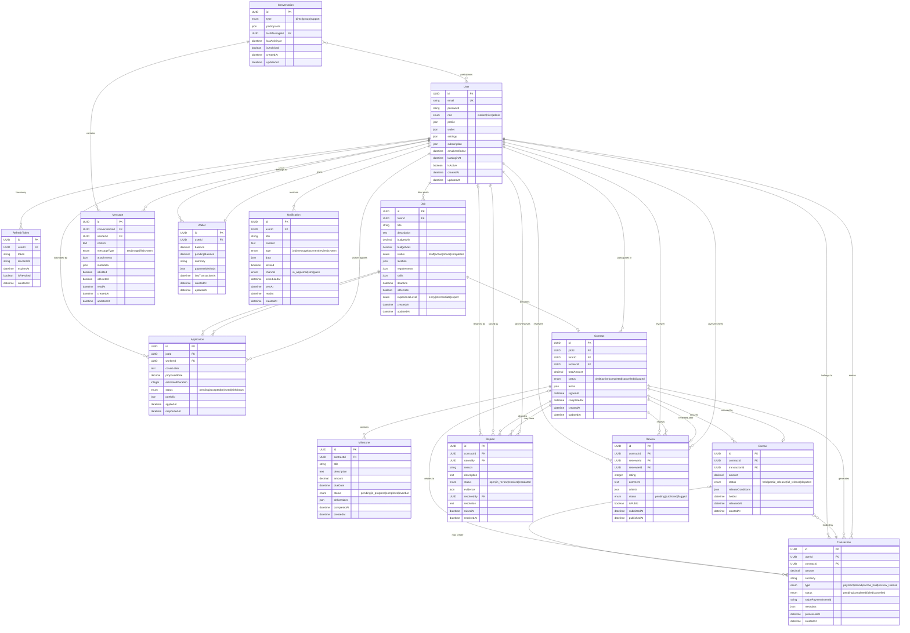

# Database Models and Relationships

This diagram shows the comprehensive database schema for the Kelmah platform, illustrating the entity relationships across all domains including user management, job processing, messaging, payments, and reviews.

## Database Overview

The Kelmah platform uses a hybrid database approach:

- **MongoDB**: Primary database for document-based storage
- **PostgreSQL**: Legacy support and relational data
- **Redis**: Caching and session management

## Entity Relationship Diagram

## Domain Models

### User Management Domain

#### User
- **Core user entity** storing authentication and profile data
- **Embedded profile data** including skills, experience, and location
- **Wallet integration** for financial management
- **Settings and preferences** for customization
- **Subscription management** for premium features

#### RefreshToken
- **JWT refresh token management** for security
- **Device tracking** for multi-device support
- **Token rotation** for enhanced security
- **Automatic cleanup** of expired tokens

### Job Management Domain

#### Job
- **Job posting entity** with rich metadata
- **Budget and requirement specification**
- **Location and remote work support**
- **Status tracking** through job lifecycle
- **Skill matching** for worker discovery

#### Application
- **Worker application to jobs**
- **Cover letter and proposal details**
- **Portfolio attachments**
- **Status tracking** (pending → accepted/rejected)
- **Rate and timeline proposals**

#### Contract
- **Formal agreement** between hirer and worker
- **Milestone-based project structure**
- **Payment terms and conditions**
- **Status management** through completion
- **Dispute resolution integration**

#### Milestone
- **Project breakdown** into deliverable chunks
- **Payment schedules** tied to completion
- **Due date tracking** and notifications
- **Deliverable management** and approval

### Messaging Domain

#### Conversation
- **Chat container** for participants
- **Direct, group, and support** conversation types
- **Participant management** and permissions
- **Activity tracking** and archival
- **Message threading** and organization

#### Message
- **Individual message entity**
- **Rich content support** (text, images, files)
- **Edit and delete** functionality
- **Read receipts** and delivery status
- **Metadata for attachments** and formatting

### Payment Domain

#### Transaction
- **Financial transaction records**
- **Stripe integration** for payment processing
- **Multiple transaction types** (payment, refund, escrow)
- **Status tracking** and reconciliation
- **Audit trail** for compliance

#### Wallet
- **User financial account**
- **Balance management** (available + pending)
- **Payment method storage**
- **Transaction history** integration
- **Multi-currency support**

#### Escrow
- **Secure fund holding** for project payments
- **Milestone-based releases**
- **Dispute protection** for both parties
- **Automatic and manual** release conditions
- **Integration with contract** completion

#### Dispute
- **Conflict resolution** for contracts
- **Evidence collection** and management
- **Admin intervention** and resolution
- **Status tracking** through resolution
- **Integration with escrow** and payments

### Review Domain

#### Review
- **Feedback system** for completed work
- **Star ratings** and detailed comments
- **Criteria-based scoring** for objectivity
- **Moderation workflow** for quality control
- **Public/private** review options

### Notification Domain

#### Notification
- **Multi-channel notification** system
- **Event-driven notifications** from all domains
- **Delivery tracking** and read status
- **Scheduling support** for delayed notifications
- **Channel preferences** (email, SMS, push, in-app)

## Data Relationships

### Primary Relationships
1. **User ↔ Job**: Hirers create jobs, workers apply
2. **Job ↔ Application**: Many workers can apply to one job
3. **Application → Contract**: Accepted applications become contracts
4. **Contract ↔ Milestone**: Projects broken into milestones
5. **Contract ↔ Payment**: Financial transactions tied to contracts

### Cross-Domain Relationships
1. **Messaging ↔ Jobs**: Job-related conversations
2. **Reviews ↔ Contracts**: Feedback after completion
3. **Disputes ↔ Payments**: Conflict resolution for finances
4. **Notifications ↔ All**: Event notifications across domains

## Database Design Patterns

### MongoDB Document Design
- **Embedded documents** for related data (user profiles, settings)
- **Referenced documents** for many-to-many relationships
- **Optimized queries** with proper indexing
- **Schema validation** for data integrity

### Data Consistency
- **Event sourcing** for cross-service consistency
- **Eventual consistency** for non-critical updates
- **ACID transactions** for critical financial operations
- **Compensation patterns** for distributed transactions

### Performance Optimization
- **Strategic indexing** for common queries
- **Data denormalization** for read-heavy operations
- **Caching layers** for frequently accessed data
- **Connection pooling** for database efficiency

### Security and Privacy
- **Data encryption** for sensitive information
- **Access control** at database level
- **Data anonymization** for analytics
- **GDPR compliance** for user data management