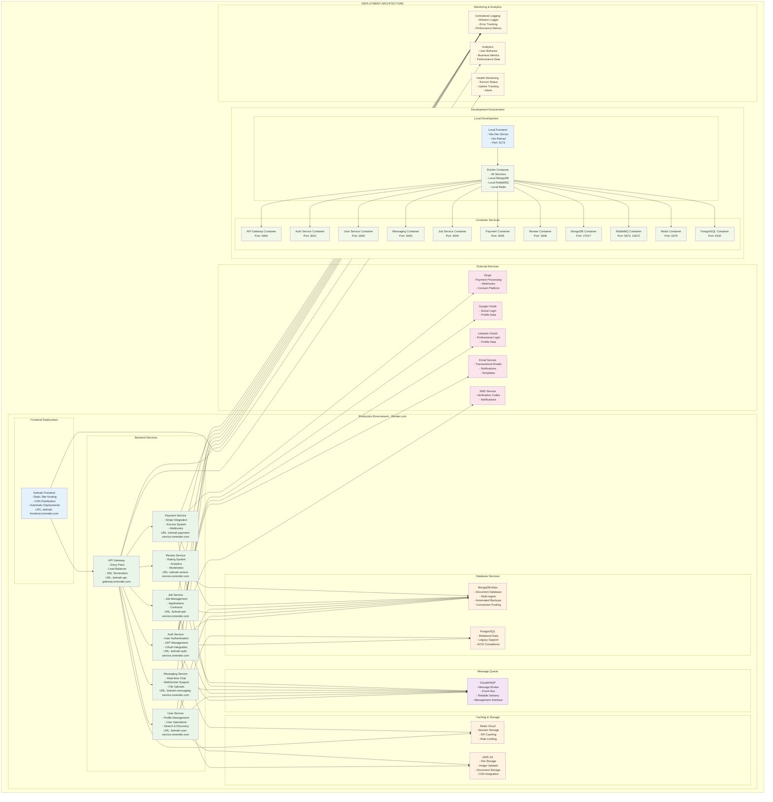

# Deployment Architecture

This diagram illustrates the complete deployment architecture of the Kelmah platform, showing both production deployment on Render.com and local development environment setup.

## Deployment Overview

The Kelmah platform supports multiple deployment environments:

- **Production**: Render.com cloud deployment
- **Development**: Local Docker Compose setup
- **External Services**: Third-party integrations
- **Monitoring**: Logging and analytics infrastructure

## Architecture Diagram

## Production Deployment (Render.com)

### Frontend Deployment
- **Static Site Hosting**: React build deployed as static assets
- **CDN Distribution**: Global content delivery for performance
- **Automatic Deployments**: Git-based CI/CD pipeline
- **SSL/TLS**: Automatic HTTPS certificate management
- **Custom Domain**: Professional domain configuration

### Backend Services
Each microservice is deployed as a separate Render service:

#### API Gateway (Port 5000)
- **Entry Point**: Single endpoint for all client requests
- **Load Balancing**: Traffic distribution across service instances
- **SSL Termination**: HTTPS handling and certificate management
- **Rate Limiting**: API throttling and abuse prevention

#### Microservices (Ports 3001-3006)
- **Independent Deployment**: Each service deploys separately
- **Auto-scaling**: Dynamic resource allocation based on load
- **Health Checks**: Automatic restart on service failure
- **Zero-downtime Deployment**: Rolling updates without interruption

### Database Services

#### MongoDB Atlas
- **Managed Database**: Fully managed MongoDB service
- **Multi-region Replication**: Data redundancy and disaster recovery
- **Automated Backups**: Point-in-time recovery capabilities
- **Connection Pooling**: Efficient database connection management
- **Security**: Encryption at rest and in transit

#### PostgreSQL
- **Managed PostgreSQL**: Render PostgreSQL service
- **Legacy Data Support**: Migration from existing systems
- **ACID Compliance**: Reliable transaction processing
- **Automated Backups**: Regular backup scheduling

### Infrastructure Services

#### CloudAMQP (RabbitMQ)
- **Message Broker**: Managed RabbitMQ service
- **Event Bus**: Inter-service communication
- **Reliable Delivery**: Message persistence and acknowledgment
- **Management Interface**: Web-based monitoring and administration

#### Redis Cloud
- **Session Storage**: User session management
- **API Caching**: Response caching for performance
- **Rate Limiting**: Request throttling data
- **Real-time Data**: WebSocket session management

#### AWS S3
- **File Storage**: User uploads and media files
- **CDN Integration**: CloudFront for global distribution
- **Security**: Access controls and encryption
- **Backup**: Versioning and lifecycle management

## Development Environment

### Local Development Setup

#### Frontend Development
- **Vite Dev Server**: Fast development server with HMR
- **Hot Module Replacement**: Instant code changes
- **Proxy Configuration**: API calls routed to backend services
- **Development Tools**: React DevTools, Redux DevTools

#### Docker Compose
Complete local environment with:
- **All Microservices**: Full backend stack
- **Databases**: MongoDB, PostgreSQL, Redis
- **Message Queue**: RabbitMQ with management interface
- **Networking**: Service discovery and communication

### Container Configuration

#### Service Containers
Each service runs in its own container:
- **Isolated Environment**: Consistent runtime across machines
- **Port Mapping**: Standard port assignments
- **Volume Mounting**: Code and data persistence
- **Environment Variables**: Configuration management

#### Infrastructure Containers
- **MongoDB**: Document database with data persistence
- **PostgreSQL**: Relational database for legacy data
- **RabbitMQ**: Message broker with management UI
- **Redis**: Caching and session storage

## External Service Integrations

### Payment Processing
- **Stripe Connect**: Multi-party payment platform
- **Webhook Handling**: Real-time payment notifications
- **Escrow System**: Secure fund holding and release
- **Dispute Resolution**: Payment conflict management

### Authentication Services
- **Google OAuth**: Social login integration
- **LinkedIn OAuth**: Professional network login
- **JWT Management**: Token generation and validation
- **Multi-factor Authentication**: Enhanced security

### Communication Services
- **Email Service**: Transactional email delivery
- **SMS Service**: Text message notifications
- **Push Notifications**: Mobile app notifications
- **Template Management**: Dynamic content generation

## Monitoring and Analytics

### Logging Infrastructure
- **Centralized Logging**: Winston logger across all services
- **Error Tracking**: Exception monitoring and alerting
- **Performance Metrics**: Response time and throughput
- **Audit Trails**: User action and system event logging

### Business Analytics
- **User Behavior**: Page views, feature usage, conversion rates
- **Business Metrics**: Revenue, transaction volume, user growth
- **Performance Data**: API response times, error rates
- **Custom Events**: Job posting, application, contract completion

### Health Monitoring
- **Service Status**: Real-time service availability
- **Uptime Tracking**: Service reliability metrics
- **Alert System**: Notification for service failures
- **Dashboard**: Visual monitoring interface

## Security and Compliance

### Network Security
- **TLS/SSL**: Encrypted communication channels
- **Firewall Rules**: Network access controls
- **VPN Access**: Secure administrative access
- **DDoS Protection**: Traffic filtering and rate limiting

### Data Security
- **Encryption at Rest**: Database and file encryption
- **Encryption in Transit**: HTTPS and secure protocols
- **Access Controls**: Role-based permissions
- **Data Anonymization**: Privacy protection for analytics

### Compliance
- **GDPR Compliance**: European data protection
- **PCI DSS**: Payment card security standards
- **SOC 2**: Security and availability controls
- **Regular Audits**: Security assessment and testing

## Deployment Pipeline

### CI/CD Process
1. **Code Push**: Developer commits to Git repository
2. **Automated Testing**: Unit and integration test execution
3. **Build Process**: Application compilation and packaging
4. **Deployment**: Automatic deployment to Render services
5. **Health Checks**: Post-deployment verification
6. **Rollback**: Automatic rollback on deployment failure

### Environment Management
- **Development**: Local Docker environment
- **Staging**: Pre-production testing environment
- **Production**: Live user-facing environment
- **Feature Branches**: Isolated feature development