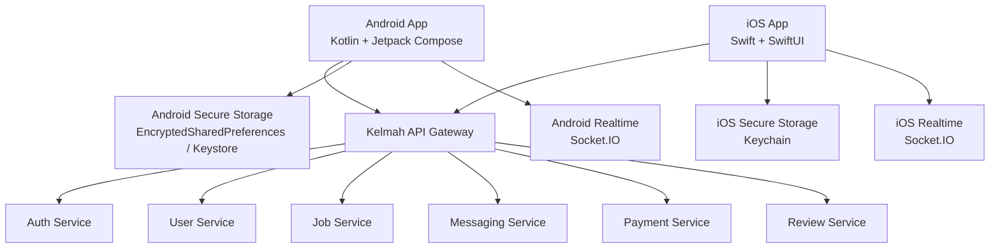

# Kelmah Native Mobile App Plan — Android + iOS

**Date**: March 6, 2026  
**Status**: Redrafted for native delivery  
**Goal**: Build two native mobile apps for Kelmah that use the existing API Gateway as the backend entry point.

---

## 1. Executive Decision

### Approved stack
- **Android**: `Kotlin` + `Jetpack Compose`
- **iOS**: `Swift` + `SwiftUI`

### Why this is the right choice now
You want:
- maximum runtime performance,
- the lightest practical mobile apps,
- very smooth scrolling and transitions,
- native Android and native iOS codebases,
- AI-assisted implementation instead of a traditional team.

For those priorities, native is the strongest option.

### Final language answer
- **Best Android language**: `Kotlin`
- **Best iOS language**: `Swift`
- **Best absolute performance option overall**: native `Kotlin + Swift`

### Trade-off
This gives the best performance, but it also means:
- two codebases,
- two UI implementations,
- two release pipelines,
- more architecture discipline is required.

Because you plan to use AI heavily, this is still workable if the codebases stay modular and the backend contracts stay stable.

---

## 2. Directory Decision

The native app roots are now created in the repository root:

- `kelmah-mobile-android/`
- `kelmah-mobile-ios/`

### Scaffold status
- Android native project skeleton has been created with Gradle, Compose app shell, DI, networking, secure storage, and starter feature modules.
- iOS native project skeleton has been created with XcodeGen project spec, SwiftUI app shell, environment config, secure storage, and starter feature modules.
- Both roots are now ready for feature-by-feature implementation.

### Auth/session status
- Both native apps now have a real auth/session foundation around one API Gateway endpoint.
- The implemented auth layer covers login, current-user bootstrap, refresh-token recovery, logout, and session cleanup.
- The current contract is documented in `spec-kit/KELMAH_NATIVE_AUTH_SESSION_FLOW_MAR06_2026.md`.

### Jobs domain status
- Both native apps now include a first real jobs domain implementation.
- Implemented flows include jobs list, category/filter controls, saved jobs, job detail, save/unsave, and apply-to-job flows.
- Home surfaces now link into the jobs experience, and jobs routing is wired within each native app shell.
- The jobs implementation contract is documented in `spec-kit/KELMAH_NATIVE_JOBS_DOMAIN_MAR06_2026.md`.

### Created native directory structure

#### Android
```text
kelmah-mobile-android/
  app/
    src/
      main/
        java/com/kelmah/mobile/
        res/
      test/
```

#### iOS
```text
kelmah-mobile-ios/
  Kelmah/
  KelmahTests/
  KelmahUITests/
```

---

## 3. Technology Decision Matrix

| Option | Performance | App Size Efficiency | Smoothness | Code Reuse | Complexity | Recommendation |
|---|---:|---:|---:|---:|---:|---|
| Kotlin + Swift | Very High | Very High | Very High | Low | High | **Selected** |
| Flutter + Dart | High | High | High | High | Medium | Good fallback |
| React Native + TypeScript | Medium-High | Medium | Medium-High | High | Medium | Not selected |

### Why native wins for Kelmah
Kelmah mobile will include:
- realtime messaging,
- long job lists,
- worker search,
- image/file upload,
- notifications,
- low-end Android support.

Native handles these best when the priority is speed and smoothness first.

---

## 4. Current Backend Fit

The existing backend already supports a native app approach.

### Confirmed architecture fit
- The **API Gateway** is the single public entry point.
- Domain services already exist behind the gateway:
  - auth
  - user
  - job
  - messaging
  - payment
  - review
- The current web platform already uses centralized auth and API resolution.
- Realtime messaging already uses **Socket.IO**, which native clients can consume.

### Audited source surface used for this plan
- [spec-kit/KELMAH_MOBILE_APP_PLAN_MAR06_2026.md](spec-kit/KELMAH_MOBILE_APP_PLAN_MAR06_2026.md)
- [spec-kit/STATUS_LOG.md](spec-kit/STATUS_LOG.md)
- [kelmah-backend/api-gateway/server.js](kelmah-backend/api-gateway/server.js)
- [kelmah-frontend/API_FLOW_ARCHITECTURE.md](kelmah-frontend/API_FLOW_ARCHITECTURE.md)
- [kelmah-frontend/src/config/environment.js](kelmah-frontend/src/config/environment.js)
- [kelmah-frontend/src/services/apiClient.js](kelmah-frontend/src/services/apiClient.js)
- [kelmah-frontend/src/services/socketUrl.js](kelmah-frontend/src/services/socketUrl.js)
- [kelmah-frontend/src/services/websocketService.js](kelmah-frontend/src/services/websocketService.js)

### Backend rule for native apps
Do not ship the mobile apps against LocalTunnel.

Use a stable production domain such as:
- `https://api.kelmah.com/api`

Realtime should use:
- `https://api.kelmah.com/socket.io`

---

## 5. Native Architecture

## Architecture Diagram



### Android app architecture
- UI: `Jetpack Compose`
- Language: `Kotlin`
- State: `ViewModel` + `StateFlow`
- Networking: `Retrofit` + `OkHttp` + `Kotlinx Serialization`
- Local storage: `Room`
- Secure tokens: Android `Keystore` / encrypted preferences
- Dependency injection: `Hilt`

### iOS app architecture
- UI: `SwiftUI`
- Language: `Swift`
- State: `ObservableObject` / `@StateObject` / modern concurrency
- Networking: `URLSession` or `Alamofire`
- Local storage: `Core Data` or `SwiftData`
- Secure tokens: `Keychain`
- Dependency injection: lightweight protocol-based injection

---

## 6. Recommended Project Structure

## Android

```text
kelmah-mobile-android/
  app/
    src/main/java/com/kelmah/mobile/
      app/
      core/
        network/
        storage/
        design/
        utils/
      features/
        auth/
        jobs/
        worker/
        hirer/
        messaging/
        notifications/
        payments/
        reviews/
        settings/
```

## iOS

```text
kelmah-mobile-ios/
  Kelmah/
    App/
    Core/
      Network/
      Storage/
      Design/
      Utils/
    Features/
      Auth/
      Jobs/
      Worker/
      Hirer/
      Messaging/
      Notifications/
      Payments/
      Reviews/
      Settings/
  KelmahTests/
  KelmahUITests/
```

The structure should stay feature-first so AI can safely work in smaller bounded modules.

---

## 7. Data Flow Plan

## A. Authentication flow

```text
Login Screen
  ↓
ViewModel / ViewState action
  ↓
Repository
  ↓
API client
  ↓
POST /api/auth/login
  ↓
API Gateway
  ↓
Auth Service
  ↓
JWT + refresh token + user payload
  ↓
Secure storage save
  ↓
Authenticated session
```

### Android implementation
- `AuthViewModel`
- `AuthRepository`
- `AuthApiService`
- token saved with encrypted storage

### iOS implementation
- `AuthViewModel`
- `AuthRepository`
- `AuthAPIClient`
- token saved in Keychain

## B. Jobs flow

```text
Jobs Screen
  ↓
ViewModel
  ↓
Repository
  ↓
GET /api/jobs?page=1&limit=20
  ↓
API Gateway
  ↓
Job Service
  ↓
Paginated response
  ↓
Normalized models
  ↓
Virtualized list rendering

### Current implementation status
- Android: implemented with Compose navigation, `JobsViewModel`, normalized repository parsing, saved jobs feed, detail screen, and application screen.
- iOS: implemented with SwiftUI `NavigationStack`, shared `JobsViewModel`, normalized repository parsing, saved jobs feed, detail view, and application view.
```

## C. Messaging flow

```text
Messages Screen
  ↓
Load conversation list from local cache
  ↓
Refresh via GET /api/messages/conversations
  ↓
Open Socket.IO connection
  ↓
Subscribe to message events
  ↓
Render chat thread
  ↓
Persist recent messages locally
```

---

## 8. Recommended Native Libraries

## Android
- `Jetpack Compose`
- `Navigation Compose`
- `Hilt`
- `Retrofit`
- `OkHttp`
- `Kotlinx Serialization`
- `Room`
- `Coil`
- `Firebase Cloud Messaging`
- `Socket.IO client`

## iOS
- `SwiftUI`
- `Combine` or native async state patterns
- `URLSession` or `Alamofire`
- `SwiftData` or `Core Data`
- `Kingfisher` or `Nuke`
- `UserNotifications`
- `Firebase Messaging` if unified push infra is preferred
- `Socket.IO-Client-Swift`

---

## 9. Feature Scope for Version 1

### Core MVP
1. Authentication
2. Jobs list and job detail
3. Worker profiles
4. Hirer job posting basics
5. Messaging
6. Notifications
7. Reviews
8. Settings

### Version 2
- payments expansion
- contracts and milestones
- biometric unlock
- voice notes
- maps
- offline drafts

---

## 10. Performance Plan

This is the main reason for choosing native.

### Target outcomes
- 60 FPS scrolling on job feeds and message lists
- fast cold start on mid-range Android devices
- low memory churn during chat and image loading
- minimal input lag on forms and chat
- smooth transitions and navigation

### Android performance rules
- keep screens small and feature-scoped
- use `LazyColumn` and paging
- avoid large recomposition surfaces in Compose
- use image thumbnails in lists
- paginate aggressively
- use background dispatchers for parsing and persistence

### iOS performance rules
- keep SwiftUI views small and deterministic
- use lazy stacks/lists correctly
- reduce expensive view invalidation
- cache images and paginated responses
- avoid doing JSON parsing on the main thread

### Shared performance rules
- upload compressed media
- use server pagination everywhere
- cache recent conversations and jobs locally
- reconnect sockets carefully
- keep notification payloads lightweight

---

## 11. AI-Assisted Solo Delivery Model

You said you will use AI to build the apps, so the plan changes from a team model to a controlled solo model.

### Recommended operating model
- You act as product owner and reviewer.
- AI generates bounded modules.
- Each app must follow the same backend contract document.
- The Android and iOS apps must use mirrored feature names and API paths.

### Required discipline for AI-built native apps
1. Keep one feature per prompt batch.
2. Freeze backend response contracts before feature generation.
3. Maintain matching names across both apps.
4. Reuse one shared API contract document for both codebases.
5. Add smoke tests after each generated feature.

### Best way to control AI output
- Build in this order:
  1. auth ✅
  2. jobs ✅
  3. register / recovery
  4. messaging
  5. notifications
  6. profiles / reviews
  7. settings / payments
- Never let AI generate the whole app in one pass.
- Generate screens, repositories, models, and navigation in separate batches.

---

## 12. Backend Requirements Before Native Buildout

### Must-have backend readiness
1. Stable production API Gateway domain
2. Stable auth/refresh contract
3. Stable upload contract
4. Stable messaging socket contract
5. Device token registration endpoint
6. Consistent error envelope
7. Reliable pagination metadata
8. Documented notification payloads

### Strongly recommended new endpoint
- `POST /api/users/me/devices`

Purpose:
- register Android/iOS push tokens,
- track device platform,
- manage notification routing.

Suggested payload:

```json
{
  "platform": "android",
  "pushToken": "...",
  "deviceName": "Samsung A54",
  "appVersion": "1.0.0"
}
```

---

## 13. Security Plan

### Android
- use encrypted local storage
- store tokens outside plain SharedPreferences
- validate uploads before sending
- use HTTPS only

### iOS
- store tokens in Keychain
- secure notification handling
- use HTTPS only
- protect local caches from sensitive leakage

### Shared
- access token rotation
- refresh token handling
- secure logout cleanup
- no browser-specific storage assumptions

---

## 14. Delivery Roadmap

## Phase 0 — Contract and scaffolding
- freeze API contracts
- create Android and iOS app foundations
- define feature naming parity
- define error model and auth model

## Phase 1 — Authentication
- login
- register
- session restore
- logout
- refresh token flow

## Phase 2 — Jobs and profiles
- jobs feed
- search/filter
- job detail
- worker profile
- hirer posting basics

## Phase 3 — Messaging and notifications
- conversations
- chat thread
- realtime socket
- push notifications
- unread state

## Phase 4 — Reviews, settings, payments summary
- ratings
- settings
- password change
- payment summary

## Phase 5 — polish and release
- performance tuning
- crash fixes
- device QA
- Play Store and App Store packaging

### AI-assisted solo estimate
- foundation + MVP: **10 to 14 weeks**
- stronger production hardening: **14 to 18 weeks**

Native is still the best choice for performance, but it is not the fastest path in raw development time.

---

## 15. Immediate Next Actions

1. Keep the native decision: `Kotlin + Swift`.
2. Keep the new root app folders:
   - `kelmah-mobile-android/`
   - `kelmah-mobile-ios/`
3. Create a single API contract document for both apps.
4. Scaffold Android first.
5. Scaffold iOS second using the same feature map.
6. Build auth before any other module.

---

## 16. Final Recommendation

If the goal is maximum speed at runtime, maximum smoothness, and the lightest serious mobile implementation, then Kelmah should proceed with:

- **Android**: `Kotlin + Jetpack Compose`
- **iOS**: `Swift + SwiftUI`

Both apps should connect to the Kelmah API Gateway on a stable production domain and share one backend contract standard.

This is the strongest performance-first path.
