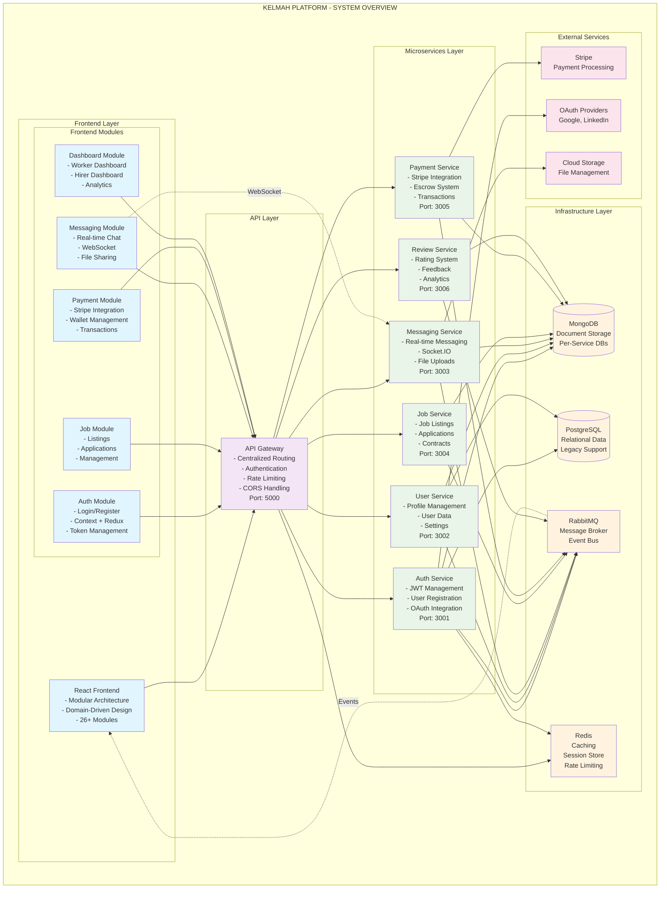

# Kelmah Platform - System Overview Architecture

This diagram provides a high-level overview of the entire Kelmah platform architecture, showing the relationship between frontend modules, API gateway, microservices, and infrastructure components.

## Architecture Overview

The Kelmah platform follows a modern microservices architecture with:

- **Frontend**: React-based SPA with modular domain-driven design
- **API Gateway**: Centralized entry point for all client requests
- **Microservices**: 6 domain-specific services (Auth, User, Job, Payment, Messaging, Review)
- **Infrastructure**: MongoDB, RabbitMQ, Redis, PostgreSQL
- **External Services**: Stripe, OAuth providers, Cloud storage

## Key Features

- **Modular Frontend**: 26+ domain-specific modules for maintainability
- **Microservices Architecture**: Independent, scalable services
- **Event-Driven Communication**: RabbitMQ for asynchronous processing
- **Real-time Messaging**: WebSocket support for instant communication
- **Secure Authentication**: JWT-based auth with refresh tokens
- **Payment Processing**: Integrated Stripe payment system

## Technology Stack

### Frontend
- **Framework**: React 18 with Vite
- **State Management**: Redux Toolkit + Context API
- **UI Library**: Material-UI (MUI)
- **Routing**: React Router v6
- **HTTP Client**: Axios with interceptors
- **Real-time**: WebSocket client

### Backend
- **Runtime**: Node.js with Express
- **Architecture**: Microservices with API Gateway
- **Database**: MongoDB (primary), PostgreSQL (legacy)
- **Message Queue**: RabbitMQ
- **Caching**: Redis
- **Authentication**: JWT with refresh tokens

### Infrastructure
- **Containerization**: Docker & Docker Compose
- **Deployment**: Render.com (Production)
- **File Storage**: AWS S3 / Cloud Storage
- **Payment**: Stripe Connect Platform
- **Monitoring**: Winston Logger + Health Checks

## Service Communication

1. **Synchronous**: HTTP/REST APIs through API Gateway
2. **Asynchronous**: RabbitMQ for event-driven communication
3. **Real-time**: WebSocket connections for messaging
4. **Caching**: Redis for session management and API caching