# 🏗️ KELMAH SYSTEM ARCHITECTURE DIAGRAMS

## 📊 **COMPLETE SYSTEM OVERVIEW**

This document contains the visual architecture diagrams for the Kelmah platform, showing how the worker and hirer frontend systems are programmed, linked, and wired to the API for data.

### **🎯 DIAGRAM 1: HIGH-LEVEL SYSTEM ARCHITECTURE**

```mermaid
graph TB
    %% Frontend Layer
    subgraph "🌐 FRONTEND (Vercel - React/Vite)"
        subgraph "📱 User Interface"
            HOME[🏠 Home Page<br/>SimplifiedHero.jsx]
            AUTH[🔐 Authentication<br/>Login/Register Pages]
        end
        
        subgraph "👷 Worker System"
            WD[📊 Worker Dashboard<br/>EnhancedWorkerDashboard.jsx]
            WP[👤 Worker Profile<br/>WorkerProfileEditPage.jsx]
            WJ[💼 Job Search<br/>JobSearchPage.jsx]
            WA[📝 Applications<br/>MyApplicationsPage.jsx]
            WE[💰 Earnings<br/>PaymentCenterPage.jsx]
            WS[📅 Schedule<br/>SchedulingPage.jsx]
        end
        
        subgraph "🏢 Hirer System"
            HD[📈 Hirer Dashboard<br/>EnhancedHirerDashboard.jsx]
            HP[👔 Hirer Profile<br/>HirerProfilePage.jsx]
            HJ[📋 Job Management<br/>JobManagementPage.jsx]
            HW[🔍 Worker Search<br/>WorkerSearchPage.jsx]
            HC[📄 Contracts<br/>ContractManagementPage.jsx]
        end
        
        subgraph "🔧 Shared Components"
            MSG[💬 Messaging<br/>MessagingPage.jsx]
            PAY[💳 Payment Center<br/>PaymentCenterPage.jsx]
            SET[⚙️ Settings<br/>SettingsPage.jsx]
            NOT[🔔 Notifications<br/>NotificationsPage.jsx]
        end
        
        subgraph "🛠 Core Infrastructure"
            API[🌐 API Client<br/>api/index.js]
            STORE[🗄️ Redux Store<br/>store/index.js]
            ROUTES[🛣️ Route Protection<br/>routes/workerRoutes.jsx<br/>routes/hirerRoutes.jsx]
        end
    end
    
    %% API Gateway Layer
    subgraph "🚪 API GATEWAY (Render)"
        GATEWAY[🚪 API Gateway<br/>Port 3000<br/>api-gateway/server.js]
    end
    
    %% Backend Services Layer
    subgraph "⚙️ MICROSERVICES (Render - Docker)"
        AUTH_SVC[🔐 Auth Service<br/>Port 5001<br/>JWT & User Auth]
        USER_SVC[👥 User Service<br/>Port 5002<br/>Profiles & Data]
        JOB_SVC[💼 Job Service<br/>Port 5003<br/>Jobs & Applications]
        MSG_SVC[💬 Messaging Service<br/>Port 5004<br/>WebSocket Chat]
        PAY_SVC[💳 Payment Service<br/>Port 5005<br/>Escrow & Transactions]
        REV_SVC[⭐ Review Service<br/>Port 5006<br/>Ratings & Reviews]
    end
    
    %% Database Layer
    subgraph "🗃️ DATABASES"
        MONGO[(🍃 MongoDB<br/>Primary Database<br/>Users, Jobs, Messages)]
        POSTGRES[(🐘 PostgreSQL<br/>Analytics & Reports)]
        REDIS[(🔴 Redis<br/>Cache & Sessions)]
        RABBITMQ[🐰 RabbitMQ<br/>Message Queue]
    end
    
    %% External Services
    subgraph "🌍 EXTERNAL SERVICES"
        PAYSTACK[💳 Paystack<br/>Payment Gateway]
        CLOUDINARY[☁️ Cloudinary<br/>Image Storage]
        SENDGRID[📧 SendGrid<br/>Email Service]
        MAPS[🗺️ Google Maps<br/>Location Services]
    end
    
    %% Frontend to API Gateway
    WD --> API
    WP --> API
    WJ --> API
    WA --> API
    WE --> API
    WS --> API
    HD --> API
    HP --> API
    HJ --> API
    HW --> API
    HC --> API
    MSG --> API
    PAY --> API
    SET --> API
    NOT --> API
    AUTH --> API
    
    %% API Gateway to Services
    API --> GATEWAY
    GATEWAY --> AUTH_SVC
    GATEWAY --> USER_SVC
    GATEWAY --> JOB_SVC
    GATEWAY --> MSG_SVC
    GATEWAY --> PAY_SVC
    GATEWAY --> REV_SVC
    
    %% Services to Databases
    AUTH_SVC --> MONGO
    USER_SVC --> MONGO
    JOB_SVC --> MONGO
    MSG_SVC --> MONGO
    PAY_SVC --> MONGO
    REV_SVC --> MONGO
    
    AUTH_SVC --> REDIS
    USER_SVC --> POSTGRES
    JOB_SVC --> POSTGRES
    
    MSG_SVC --> RABBITMQ
    PAY_SVC --> RABBITMQ
    
    %% External Service Connections
    PAY_SVC --> PAYSTACK
    USER_SVC --> CLOUDINARY
    AUTH_SVC --> SENDGRID
    JOB_SVC --> MAPS
    
    %% Styling
    classDef frontend fill:#e1f5fe
    classDef worker fill:#c8e6c9
    classDef hirer fill:#fff3e0
    classDef shared fill:#f3e5f5
    classDef infrastructure fill:#fce4ec
    classDef gateway fill:#e8f5e8
    classDef service fill:#fff8e1
    classDef database fill:#e3f2fd
    classDef external fill:#fafafa
    
    class HOME,AUTH frontend
    class WD,WP,WJ,WA,WE,WS worker
    class HD,HP,HJ,HW,HC hirer
    class MSG,PAY,SET,NOT shared
    class API,STORE,ROUTES infrastructure
    class GATEWAY gateway
    class AUTH_SVC,USER_SVC,JOB_SVC,MSG_SVC,PAY_SVC,REV_SVC service
    class MONGO,POSTGRES,REDIS,RABBITMQ database
    class PAYSTACK,CLOUDINARY,SENDGRID,MAPS external
```

### **🎯 DIAGRAM 2: DETAILED FRONTEND FAULT-TOLERANCE ARCHITECTURE**

```mermaid
graph TD
    subgraph "🎯 FRONTEND ARCHITECTURE - FAULT TOLERANT DESIGN"
        
        subgraph "📱 PRESENTATION LAYER"
            APP[🏠 App.jsx<br/>Main Entry Point]
            LAYOUT[🎨 Layout.jsx<br/>Global Layout]
            ROUTES[🛣️ Routes<br/>Navigation Logic]
        end
        
        subgraph "👷 WORKER DOMAIN MODULE"
            WD[📊 WorkerDashboardPage.jsx]
            WED[📈 EnhancedWorkerDashboard.jsx]
            WP[👤 WorkerProfileEditPage.jsx]
            WJS[🔍 JobSearchPage.jsx]
            WA[📝 MyApplicationsPage.jsx]
            WE[💰 PaymentCenterPage.jsx]
            
            subgraph "Worker API Layer"
                WAPI[🔌 workersApi.js]
                WSLICE[🗄️ workerSlice.js]
            end
        end
        
        subgraph "🏢 HIRER DOMAIN MODULE"
            HD[📈 HirerDashboardPage.jsx]
            HED[📊 EnhancedHirerDashboard.jsx]
            HP[👔 HirerProfilePage.jsx]
            HJM[📋 JobManagementPage.jsx]
            HWS[🔍 WorkerSearchPage.jsx]
            
            subgraph "Hirer API Layer"
                HAPI[🔌 hirersApi.js]
                HSLICE[🗄️ hirerSlice.js]
            end
        end
        
        subgraph "🔧 SHARED DOMAIN MODULES"
            subgraph "💬 Messaging Module"
                MSG[💬 MessagingPage.jsx]
                MSGAPI[🔌 messagesApi.js]
                MSGWS[🌐 WebSocket Service]
            end
            
            subgraph "💳 Payment Module"
                PAY[💳 PaymentCenterPage.jsx]
                PAYAPI[🔌 paymentsApi.js]
                ESCROW[💰 EscrowManager.jsx]
            end
            
            subgraph "⚙️ Settings Module"
                SET[⚙️ SettingsPage.jsx]
                SETAPI[🔌 settingsApi.js]
                SETHOOK[🎣 useSettings.js]
            end
            
            subgraph "🔔 Notification Module"
                NOT[🔔 NotificationsPage.jsx]
                NOTAPI[🔌 notificationsApi.js]
                NOTCTX[📡 NotificationContext.jsx]
            end
        end
        
        subgraph "🛠 CORE INFRASTRUCTURE"
            APICORE[🌐 api/index.js<br/>Central API Client]
            STORE[🗄️ Redux Store]
            AUTH[🔐 Auth System]
            STORAGE[💾 Secure Storage]
            
            subgraph "Error Handling"
                EB[🛡️ ErrorBoundary.jsx]
                EH[⚠️ Error Handlers]
            end
        end
    end
    
    subgraph "🚪 API GATEWAY"
        GATEWAY[🚪 API Gateway<br/>api-gateway/server.js<br/>Port 3000]
    end
    
    subgraph "⚙️ BACKEND MICROSERVICES"
        AUTH_SVC[🔐 Auth Service<br/>Port 5001]
        USER_SVC[👥 User Service<br/>Port 5002]
        JOB_SVC[💼 Job Service<br/>Port 5003]
        MSG_SVC[💬 Message Service<br/>Port 5004]
        PAY_SVC[💳 Payment Service<br/>Port 5005]
        REV_SVC[⭐ Review Service<br/>Port 5006]
    end
    
    %% Frontend Connections
    APP --> LAYOUT
    LAYOUT --> ROUTES
    ROUTES --> WD
    ROUTES --> HD
    ROUTES --> MSG
    ROUTES --> PAY
    ROUTES --> SET
    ROUTES --> NOT
    
    %% Worker Domain Flow
    WD --> WED
    WED --> WAPI
    WP --> WAPI
    WJS --> WAPI
    WA --> WAPI
    WE --> WAPI
    WAPI --> WSLICE
    
    %% Hirer Domain Flow
    HD --> HED
    HED --> HAPI
    HP --> HAPI
    HJM --> HAPI
    HWS --> HAPI
    HAPI --> HSLICE
    
    %% Shared Module Flows
    MSG --> MSGAPI
    MSG --> MSGWS
    PAY --> PAYAPI
    PAY --> ESCROW
    SET --> SETAPI
    SET --> SETHOOK
    NOT --> NOTAPI
    NOT --> NOTCTX
    
    %% Core Infrastructure
    WAPI --> APICORE
    HAPI --> APICORE
    MSGAPI --> APICORE
    PAYAPI --> APICORE
    SETAPI --> APICORE
    NOTAPI --> APICORE
    
    APICORE --> AUTH
    APICORE --> STORAGE
    WSLICE --> STORE
    HSLICE --> STORE
    
    %% Error Handling
    WED --> EB
    HED --> EB
    MSG --> EB
    PAY --> EB
    
    %% API Gateway Connection
    APICORE --> GATEWAY
    
    %% Backend Service Connections
    GATEWAY --> AUTH_SVC
    GATEWAY --> USER_SVC
    GATEWAY --> JOB_SVC
    GATEWAY --> MSG_SVC
    GATEWAY --> PAY_SVC
    GATEWAY --> REV_SVC
    
    %% Styling for clarity
    classDef worker fill:#c8e6c9,stroke:#4caf50,stroke-width:2px
    classDef hirer fill:#fff3e0,stroke:#ff9800,stroke-width:2px
    classDef shared fill:#f3e5f5,stroke:#9c27b0,stroke-width:2px
    classDef core fill:#e3f2fd,stroke:#2196f3,stroke-width:2px
    classDef backend fill:#fff8e1,stroke:#ffc107,stroke-width:2px
    classDef gateway fill:#e8f5e8,stroke:#4caf50,stroke-width:3px
    
    class WD,WED,WP,WJS,WA,WE,WAPI,WSLICE worker
    class HD,HED,HP,HJM,HWS,HAPI,HSLICE hirer
    class MSG,PAY,SET,NOT,MSGAPI,PAYAPI,SETAPI,NOTAPI,MSGWS,ESCROW,SETHOOK,NOTCTX shared
    class APP,LAYOUT,ROUTES,APICORE,STORE,AUTH,STORAGE,EB,EH core
    class GATEWAY gateway
    class AUTH_SVC,USER_SVC,JOB_SVC,MSG_SVC,PAY_SVC,REV_SVC backend
```

---

## 🛡️ **FAULT-TOLERANCE DESIGN**

### **Key Principles:**
1. **Module Isolation** - Each domain (worker/hirer/messaging/payment) is independent
2. **Error Boundaries** - Component failures are contained
3. **API Resilience** - Multiple fallback strategies for data loading
4. **Progressive Enhancement** - Core features work even if advanced features fail

### **Implementation Status:**
- ✅ **Error Boundaries** - Implemented in all major components
- ✅ **Array Validation** - All `.map()` operations protected
- ✅ **API Fallbacks** - Mock data and cached responses
- ✅ **Module Independence** - Domain-driven architecture

---

## 📋 **FILE ORGANIZATION**

### **🎯 Critical Files (Must Never Fail):**
- `App.jsx` - Application entry point
- `api/index.js` - Central API configuration  
- `utils/secureStorage.js` - Authentication storage
- `components/common/ErrorBoundary.jsx` - Error containment

### **👷 Worker Domain Files:**
- `modules/worker/pages/WorkerDashboardPage.jsx`
- `modules/dashboard/components/worker/EnhancedWorkerDashboard.jsx`
- `modules/worker/pages/WorkerProfileEditPage.jsx`
- `api/services/workersApi.js`

### **🏢 Hirer Domain Files:**
- `modules/hirer/pages/HirerDashboardPage.jsx`
- `modules/dashboard/components/hirer/EnhancedHirerDashboard.jsx`
- `modules/hirer/pages/JobManagementPage.jsx`
- `api/services/hirersApi.js`

### **🔧 Shared Domain Files:**
- `modules/messaging/pages/MessagingPage.jsx`
- `modules/payment/pages/PaymentCenterPage.jsx`
- `modules/settings/pages/SettingsPage.jsx`
- `modules/notifications/pages/NotificationsPage.jsx`

---

## 🚀 **SYSTEM BENEFITS**

### **✅ Reliability:**
- Individual module failures don't crash the entire system
- Multiple fallback strategies ensure continuous operation
- Graceful degradation maintains core functionality

### **✅ Scalability:**
- Microservices can scale independently
- Frontend modules can be developed in parallel
- Domain-driven design supports team collaboration

### **✅ User Experience:**
- Fast loading with progressive enhancement
- Offline capabilities for poor network conditions
- Visual feedback for all loading states

### **✅ Developer Experience:**
- Clear module boundaries
- Comprehensive error handling
- Easy debugging and testing

---

**This architecture ensures Kelmah remains operational and provides excellent user experience for Ghana's vocational workers and hirers, even when individual components experience issues.**
